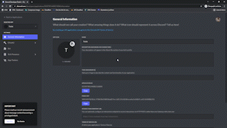

<div align='middle'>
  <h1>Rich Presence :hourglass:</h1><p>Let others on discord see what you're doing!</p>
</div>
 
## How to use :wrench:

Change the "client_id" variable to your Application ID

```py
client_id = "Your Application ID"
```

## Example 📍

<div>
    <p>Examples of how the script works :D</p>
</div>
</img>

## License

Rich Presence is released under [the MIT License](LICENSE). Check [LICENSE](LICENSE) file for more information.
